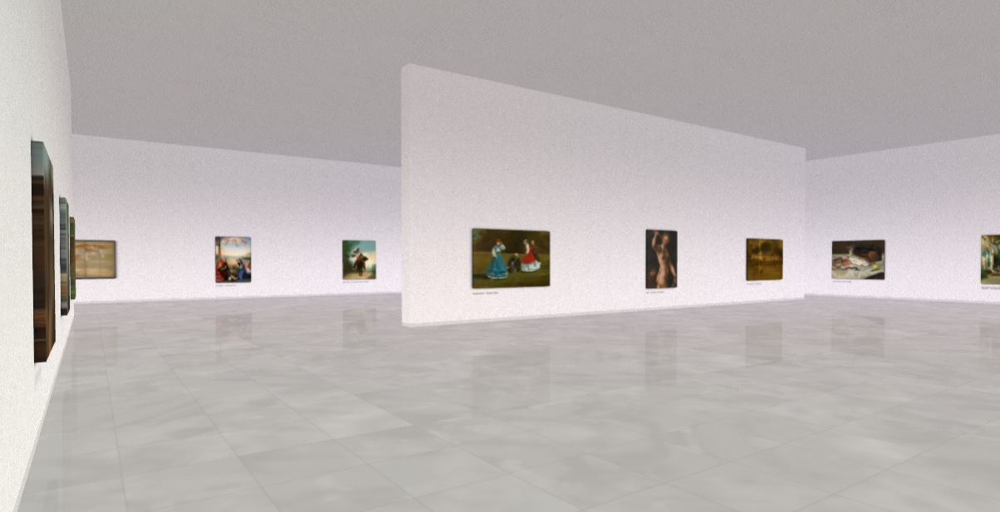

# Virtual Art Gallery



## Description

This project simulates an art gallery in your browser using [REGL](https://github.com/regl-project/regl).
It aims at reproducing the experience of a real art gallery.
The architecture is generated using a 10km long 6th order [Hilbert Curve](https://en.wikipedia.org/wiki/Hilbert_curve).
The paintings are asynchronously loaded from the [ARTIC](https://api.artic.edu) and placed on the walls.
Image loader can be replaced can be replaced through configuration.
You can use this project to display your own artworks.

## Setup

Installation :
```shell
git clone https://github.com/adeprez/virtual-art-gallery.git
npm install
```
Start the budo dev server : 
```shell
npm start
```
Build : 
```shell
npm build
```

## Configuration

You can configure the room aspect and datasource through the configuration passed to the index module :

```
require('./index')({
  resources: {
    wallTexture: 'res/wall.jpg',
    floorTexture: 'res/floor.jpg',
    roofTexture: 'res/wall.jpg',
  },
  map: {
    gridSize: 6, // Log2 of the grid size (keep the value between [1, 6])
    roomSize: 9,
    roomLight: 0.55,
    floorReflexion: 0.98,
    floorLight: 0.6,
    floorIntensity: 0.15,
    floorTextureSize: 8,
    wallHeight: 8,
    wallThickness: 0.25,
    wallRemoval: 0.5, // Random wall removal proportion
    wallTextureSize: 1,
    roofLight: .05,
    roofIntensity: 0.65,
    roofTextureSize: 4,
  },
  loader: require('./loader/artic'),
  loadCount: 10,
});
```